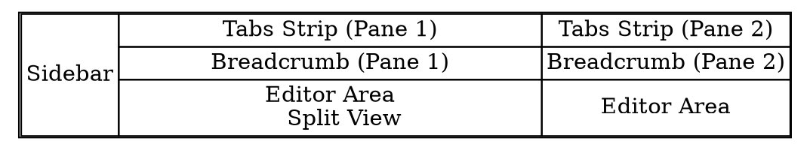

# UX wireframes

## Main window

Below is wireframe panels structure (in Graphviz code).



Text description on each of the panels in the above structure wireframe:

- Left column: sidebar and document stack ("pinned documents" or "document shorcut box")
    - sidebar displays folder tree, and provides UI for file operations, context menus etc.
    - document stack provides a means to quickly open some regularly visited files during a period (e.g. a week, a month), either as active note or an opened tab.
- Center column: one editing pane, with tab strip, breadcrumb and editor area, and the editor area is splitted to two views that can display different parts of the same note.
- Right column: another editing pane, with tab strip, breadcrumb and editor area as well, but demonstrate a state where the user does not make a split view for the same file.


Below is the same wireframe, with details, with example data:

```txt
+----------------------------+-------------------------------------------------+--------------------------------+
|  [placeholder...        ]  |  janitor.md | [overview.md] | manager.md        | factions.md | [overview.md]    |
|                            +-------------------------------------------------+--------------------------------+
| vault-root/                | /overview.md                                    | /overview.md                   |
| ├──characters/             +-------------------------------------------------+--------------------------------+
| │  ├──char-summ.md         | # Overview section 1                            |                                |
| │  ├──main-char/           |                                                 | ...                            |
| │  │  └──janitor.md        | [[95463a7b-60af-438f-81a3-a10f01f610d8]]        |                                |
| │  └──sub-char/            |                                                 | # Overview section 13          |
| │     └──manager.md        | # Title                                         |                                |
| ├──overview.md             | dgfhngjmf test12                                | xxxxxxxxx                      |
| ├──world/                  |                                                 |                                |
| │  ├──faction-dynamics.md  | ## Sub section                                  | ...                            |
| │  ├──factions.md          | This is a table                                 |                                |
| │  └──technologies.md      | | Month    | Savings |                          | # Overview section 14          |
| └──writing-rules.md        | | -------- | ------- |                          |                                |
|                            | | January  | $250    |                          | ...                            |
|                            | | February | $80     |                          | ...                            |
|                            | | March    | $420    |                          | ...                            |
|                            |                                                 | ...                            |
|                            | # Overview section 2                            | ...                            |
|                            | ...                                             | ...                            |
|                            | ...                                             | ...                            |
|                            | ...                                             | ...                            |
|                            | ...                                             | ...                            |
+----------------------------+-------------------------------------------------+ ...                            |
| overview.md | pn1, pn2     | # Overview section 5                            | ...                            |
| faction-dynamics.md        |                                                 | ...                            |
| factions.md | pn2          | 47ifdgkfhk, oafkbhf                             | ...                            |
| writing-rules.md           |                                                 | ...                            |
|                            | # Title 5                                       | ...                            |
|                            | dgfhngjmf test12                                | ...                            |
|                            |                                                 | ...                            |
|                            | ...                                             | ...                            |
|                            |                                                 | ...                            |
|                            | # Overview section 6                            | ...                            |
|                            |                                                 | ...                            |
|                            | ...                                             | ...                            |
+----------------------------+-------------------------------------------------+--------------------------------+
```